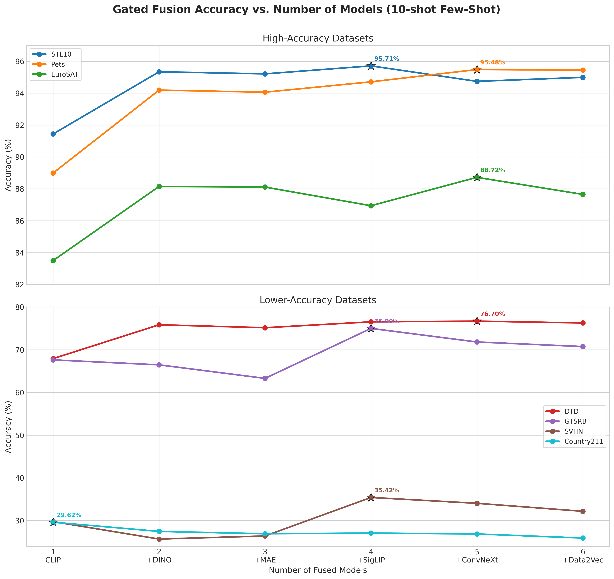
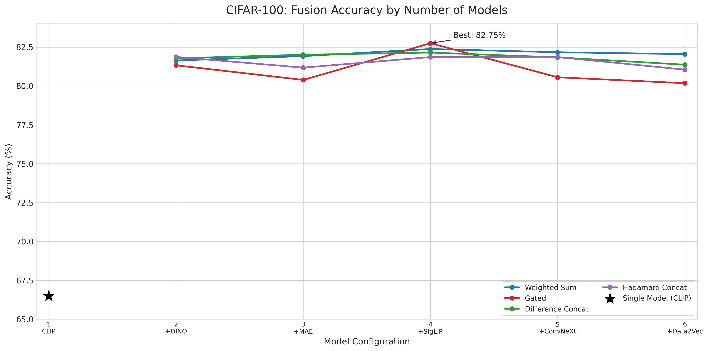
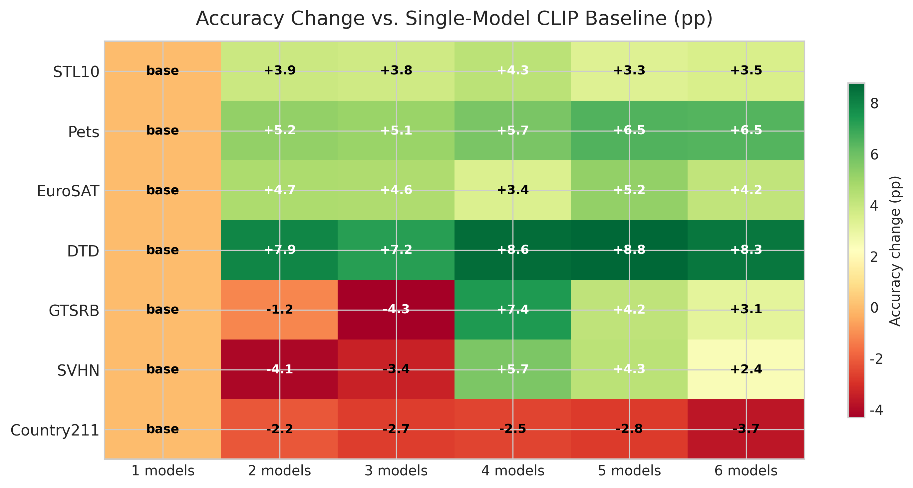
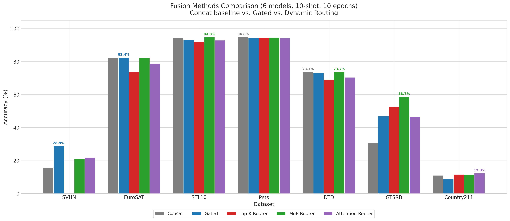
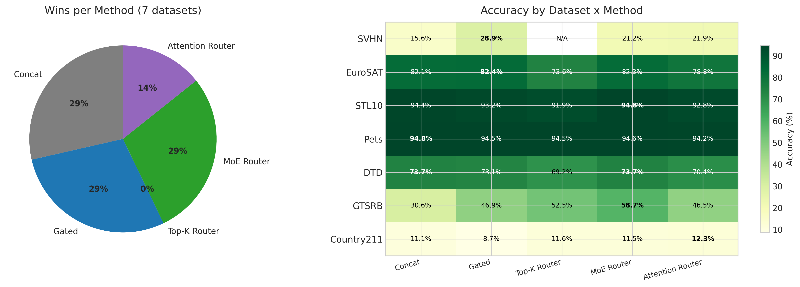
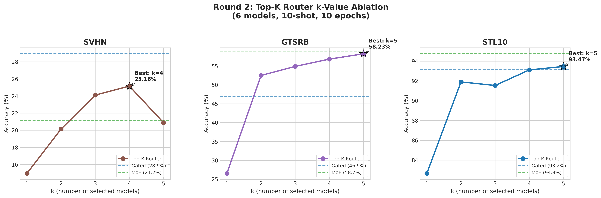

# Feature Classification with Pretrained Vision Models

使用 HuggingFace Transformers 的预训练模型提取特征，配合 MLP 分类器。当前默认支持 10 个训练信号差异更大的预训练视觉模型，以及 19 个数据集。默认训练模式为 few-shot：每个类别固定使用 10 张训练图像。

## 国内环境推荐流程

下面这套流程按中国大陆网络环境写，目标是：

1. 依赖安装尽量走国内镜像
2. Hugging Face 模型下载走镜像或本地代理
3. 数据、模型、缓存统一放到一个大目录里

先选一个大文件目录，下面统一用：

```bash
export STORAGE_DIR=/path/to/bigfiles
mkdir -p "$STORAGE_DIR"
```

### 第 1 步：先开代理或镜像

如果你本机或服务器已经有代理，先在当前终端导出。把下面的 `127.0.0.1:7890` 替换成你自己的代理地址：

```bash
export http_proxy=http://127.0.0.1:7890
export https_proxy=http://127.0.0.1:7890
export all_proxy=socks5://127.0.0.1:7890
```

Hugging Face 模型建议再加一个国内镜像：

```bash
export HF_ENDPOINT=https://hf-mirror.com
```

如果你没有代理，只想先试镜像，也可以只执行上一条 `HF_ENDPOINT`。

### 第 2 步：克隆代码

```bash
git clone --branch test --single-branch \
    https://github.com/yibol9768-alt/Quantifying-Representation-Reliability.git
cd Quantifying-Representation-Reliability
```

### 第 3 步：创建环境并安装依赖

推荐直接用下面这一组命令。`pip` 走清华镜像，通常比默认源稳。

```bash
conda create -n feature_cls python=3.10 -y
conda activate feature_cls

python -m pip install --upgrade pip
python -m pip install -r requirements.txt \
    -i https://pypi.tuna.tsinghua.edu.cn/simple
```

安装完成后建议先检查一下：

```bash
python -c "import torch, torchvision, transformers; print(torch.__version__)"
```

如果你的系统里没有 `python` 命令，就把下面所有命令里的 `python` 替换成 `python3`。

### 第 4 步：下载模型和数据

先安装 Hugging Face CLI。2026 年更推荐使用 `hf`，`download_models.py` 也会优先调用它：

```bash
python -m pip install -U huggingface_hub
hf --help
```

如果你想下载所有当前支持的 10 个模型和所有支持的数据集：

```bash
# 下载所有模型
python download_models.py --models --storage_dir "$STORAGE_DIR"

# 下载所有torchvision支持的数据集
python download_models.py --all_datasets --storage_dir "$STORAGE_DIR"

# 查看需要手动下载的数据集
python download_models.py --manual_instructions
```

如果你想只下载特定的数据集：

```bash
# CIFAR系列
python download_models.py --cifar10 --storage_dir "$STORAGE_DIR"
python download_models.py --cifar100 --storage_dir "$STORAGE_DIR"

# CLIP论文数据集
python download_models.py --mnist --storage_dir "$STORAGE_DIR"
python download_models.py --svhn --storage_dir "$STORAGE_DIR"
python download_models.py --dtd --storage_dir "$STORAGE_DIR"
python download_models.py --eurosat --storage_dir "$STORAGE_DIR"
python download_models.py --gtsrb --storage_dir "$STORAGE_DIR"
python download_models.py --country211 --storage_dir "$STORAGE_DIR"
python download_models.py --resisc45 --storage_dir "$STORAGE_DIR"
```

### 第 5 步：检查文件是否真的下好了

```bash
ls "$STORAGE_DIR/models"
ls "$STORAGE_DIR/data"
```

正常情况下你应该能看到：

```text
$STORAGE_DIR/models/
├── vit-mae-base/           # MAE
├── clip-vit-base-patch16/  # CLIP
├── dinov2-base/            # DINOv2-Base
├── siglip-base-patch16-224/ # SigLIP
├── data2vec-vision-base/   # Data2Vec-Vision
├── vit-base-patch16/       # ViT
├── swin-base/              # Swin
├── beit-base/              # BEiT
├── openclip-vit-b32/       # OpenCLIP
└── convnext-base/          # ConvNeXt

$STORAGE_DIR/data/
├── cifar10/
├── cifar100/
├── mnist/
├── svhn/
└── ...
```

### 第 6 步：运行训练

```bash
python main.py --dataset cifar100 --model clip \
    --storage_dir "$STORAGE_DIR" \
    --epochs 10 --batch_size 128 --cache_dtype fp32
```

如果你想关闭默认的 few-shot，改用完整训练集：

```bash
python main.py --dataset cifar100 --model clip \
    --storage_dir "$STORAGE_DIR" \
    --disable_fewshot \
    --epochs 10 --batch_size 128 --cache_dtype fp32
```

## 模型说明

### Vision Transformer 系列

| 模型 | 参数 | 特征维度 | 本地路径 | 说明 |
|------|------|----------|----------|------|
| ViT | `--model vit` | 768 | `<storage_dir>/models/vit-base-patch16` | Google标准ViT |
| Swin | `--model swin` | 1024 | `<storage_dir>/models/swin-base` | Microsoft层级ViT |
| BEiT | `--model beit` | 768 | `<storage_dir>/models/beit-base` | Microsoft Bootstrapped ImageText |
| Data2Vec-Vision | `--model data2vec` | 768 | `<storage_dir>/models/data2vec-vision-base` | Facebook latent-prediction 自监督 |

### 自监督系列

| 模型 | 参数 | 特征维度 | 本地路径 | 说明 |
|------|------|----------|----------|------|
| MAE | `--model mae` | 768 | `<storage_dir>/models/vit-mae-base` | Facebook MAE Base |
| DINO | `--model dino` | 768 | `<storage_dir>/models/dinov2-base` | Facebook DINOv2 Base |

### 图文对齐系列

| 模型 | 参数 | 特征维度 | 本地路径 | 说明 |
|------|------|----------|----------|------|
| CLIP | `--model clip` | 768 | `<storage_dir>/models/clip-vit-base-patch16` | OpenAI CLIP ViT-B/16 |
| OpenCLIP | `--model openclip` | 768 | `<storage_dir>/models/openclip-vit-b32` | LAION CLIP ViT-B/32 (`laion2B-s34B-b79K`) |
| SigLIP | `--model siglip` | 768 | `<storage_dir>/models/siglip-base-patch16-224` | Google SigLIP，WebLI 图文对齐 |

### 现代 CNN

| 模型 | 参数 | 特征维度 | 本地路径 | 说明 |
|------|------|----------|----------|------|
| ConvNeXt | `--model convnext` | 1024 | `<storage_dir>/models/convnext-base` | Facebook ConvNeXt Base 224 |

说明：
- 默认模型池里移除了 `deit` 和 `*_large` 这类与现有模型在结构或预训练范式上高度重叠的变体，优先保留训练目标和数据来源差异更大的模型。
- 旧版本 README 里的 `EVA`、`SAM`、`ALBEF` 已从默认支持列表移除。
- 原因分别是：仓库/权重入口在 2026 年已经不稳定，或与当前分类特征提取器的 `transformers` 加载类并不匹配，容易出现“能下载但不能正确加载/提特征”的问题。

## 数据集说明

### 基础数据集

| 数据集 | 类别数 | 图片尺寸 | 参数 | 说明 |
|--------|--------|----------|------|------|
| CIFAR-10 | 10 | 32x32 | `--dataset cifar10` | 基础分类 |
| CIFAR-100 | 100 | 32x32 | `--dataset cifar100` | 细粒度分类 |
| STL-10 | 10 | 96x96 | `--dataset stl10` | 无监督学习 |

### ImageNet 系列

| 数据集 | 类别数 | 图片尺寸 | 参数 | 说明 |
|--------|--------|----------|------|------|
| Tiny ImageNet | 200 | 64x64 | `--dataset tiny_imagenet` | ImageNet子集 |
| Caltech-101 | 101 | 224x224 | `--dataset caltech101` | 物体分类 |

### 细粒度分类数据集

| 数据集 | 类别数 | 图片尺寸 | 参数 | 说明 |
|--------|--------|----------|------|------|
| Flowers-102 | 102 | 224x224 | `--dataset flowers102` | 细粒度花卉 |
| Food-101 | 101 | 224x224 | `--dataset food101` | 食物分类 |
| Oxford-IIIT Pets | 37 | 224x224 | `--dataset pets` | 宠物品种 |
| CUB-200-2011 | 200 | 224x224 | `--dataset cub200` | 鸟类分类 |

### CLIP 论文数据集

| 数据集 | 类别数 | 图片尺寸 | 参数 | torchvision支持 | 说明 |
|--------|--------|----------|------|-----------------|------|
| MNIST | 10 | 28x28→224 | `--dataset mnist` | ✅ | 手写数字 (灰度转RGB) |
| SVHN | 10 | 224x224 | `--dataset svhn` | ✅ | 街景门牌号 |
| SUN397 | 397 | 224x224 | `--dataset sun397` | ❌ | 场景分类 (需手动) |
| Stanford Cars | 196 | 224x224 | `--dataset stanford_cars` | ❌ | 汽车分类 (需手动) |
| DTD | 47 | 224x224 | `--dataset dtd` | ✅ | 纹理描述 |
| EuroSAT | 10 | 224x224 | `--dataset eurosat` | ✅ | 卫星图像 |
| GTSRB | 43 | 224x224 | `--dataset gtsrb` | ✅ | 交通标志 |
| Country211 | 211 | 224x224 | `--dataset country211` | ✅ | 国家识别 |
| FGVC Aircraft | 100 | 224x224 | `--dataset aircraft` | ❌ | 飞机类型 (需手动) |
| Resisc45 | 45 | 224x224 | `--dataset resisc45` | ✅ | 遥感场景 |

## CLIP 论文数据集下载说明

### torchvision 支持的数据集

以下数据集可通过脚本自动下载：

```bash
# MNIST
python download_models.py --mnist --storage_dir "$STORAGE_DIR"

# SVHN
python download_models.py --svhn --storage_dir "$STORAGE_DIR"

# DTD
python download_models.py --dtd --storage_dir "$STORAGE_DIR"

# EuroSAT
python download_models.py --eurosat --storage_dir "$STORAGE_DIR"

# GTSRB
python download_models.py --gtsrb --storage_dir "$STORAGE_DIR"

# Country211
python download_models.py --country211 --storage_dir "$STORAGE_DIR"

# Resisc45
python download_models.py --resisc45 --storage_dir "$STORAGE_DIR"

# 或一次性下载所有torchvision支持的数据集
python download_models.py --all_datasets --storage_dir "$STORAGE_DIR"
```

### 需要手动下载的数据集

以下数据集需要手动下载并解压到对应目录：

#### SUN397
1. 下载: http://vision.princeton.edu/projects/2010/SUN/download.html
2. 解压到 `<storage_dir>/data/sun397`
3. 目录结构应为:
   ```
   sun397/
   ├── train/
   │   ├── abbey/
   │   │   ├── xxx.jpg
   │   │   └── ...
   │   └── ...
   └── test/
       ├── abbey/
       └── ...
   ```

#### Stanford Cars
1. 下载: https://ai.stanford.edu/~jkrause/cars/car_dataset.html
2. 解压到 `<storage_dir>/data/stanford_cars`
3. 目录结构应为:
   ```
   stanford_cars/
   ├── train/
   │   ├── AM General Hummer SUV 2000/
   │   │   ├── xxx.jpg
   │   │   └── ...
   │   └── ...
   └── test/
       ├── AM General Hummer SUV 2000/
       └── ...
   ```

#### FGVC Aircraft
1. 下载: https://www.robots.ox.ac.uk/~vgg/data/aircraft/
2. 解压到 `<storage_dir>/data/aircraft`
3. 目录结构应为:
   ```
   aircraft/
   ├── train/
   │   ├── 707/
   │   │   ├── xxx.jpg
   │   │   └── ...
   │   └── ...
   └── test/
       ├── 707/
       └── ...
   ```

查看完整的手动下载说明：

```bash
python download_models.py --manual_instructions
```

## 运行示例

### 单模型训练

```bash
# 使用任意单个模型
python main.py --dataset cifar100 --model vit \
    --storage_dir "$STORAGE_DIR" \
    --epochs 10 --batch_size 128 --cache_dtype fp32

python main.py --dataset cifar100 --model swin \
    --storage_dir "$STORAGE_DIR" \
    --epochs 10 --batch_size 128 --cache_dtype fp32

# 使用CLIP论文数据集
python main.py --dataset mnist --model clip \
    --storage_dir "$STORAGE_DIR" \
    --epochs 10 --batch_size 128 --cache_dtype fp32

python main.py --dataset svhn --model dino \
    --storage_dir "$STORAGE_DIR" \
    --epochs 10 --batch_size 128 --cache_dtype fp32
```

### 多模型融合

支持从当前 10 个可验证模型中任意选择 2 个及以上进行融合。

建议：
- `concat`、`proj_concat`、`weighted_sum`、`gated`、`difference_concat`、`hadamard_concat` 适合 2-10 个模型的横向实验。
- `comm`、`mmvit` 更适合 2-3 个以 ViT/CLIP/DINO 为主的 token 型 backbone。
- `topk_router`、`moe_router`、`attention_router` 是动态路由方法，适合候选模型较多时让网络自动学习最优模型子集/权重。
- 默认所有训练都会使用 few-shot 训练集，每类固定 10-shot；具体采样由 `--seed` 控制。

```bash
# 两模型融合
python main.py --dataset cifar100 --model fusion \
    --fusion_method concat --fusion_models vit,clip \
    --storage_dir "$STORAGE_DIR" \
    --epochs 10 --batch_size 128 --cache_dtype fp32

# 三模型融合
python main.py --dataset cifar100 --model fusion \
    --fusion_method comm --fusion_models mae,clip,dino \
    --storage_dir "$STORAGE_DIR" \
    --epochs 10 --batch_size 128 --cache_dtype fp32

# 新模型融合
python main.py --dataset cifar100 --model fusion \
    --fusion_method mmvit --fusion_models swin,dino \
    --storage_dir "$STORAGE_DIR" \
    --epochs 10 --batch_size 128 --cache_dtype fp32
```

### Fusion 方法

#### 简单 Baseline 方法（推荐作为 baseline）

| 方法 | 参数 | 公式 | 特征维度 | 说明 |
|------|------|------|----------|------|
| Concat | `--fusion_method concat` | `[f_c; f_d; f_m]` | sum(dims) | L2 归一化后直接拼接 |
| Projected Concat | `--fusion_method proj_concat` | `[P_c(f_c); P_d(f_d); P_m(f_m)]` | 256×N | 先投影到统一维度再拼接 |
| Weighted Sum | `--fusion_method weighted_sum` | `α_c·z_c + α_d·z_d + α_m·z_m` | 512 | 可学习加权和 |
| Gated Fusion | `--fusion_method gated` | `g⊙[z_c;z_d;z_m]` | 512 | 门控融合，sample-wise自适应权重 |
| Difference Concat | `--fusion_method difference_concat` | `[z;z;z_c-z_d;z_c-z_m;z_d-z_m]` | 256×N+pairwise | 显式建模表征差异 |
| Hadamard Concat | `--fusion_method hadamard_concat` | `[z;z;z_c⊙z_d;z_c⊙z_m;z_d⊙z_m]` | 256×N+pairwise | 逐元素乘积交互 |
| Bilinear Concat | `--fusion_method bilinear_concat` | `[z; sqrt_norm(z_i⊗z_j)]` | 64×N+4096×pairs | 外积捕捉所有跨维度交叉项 (Lin et al., ICCV 2015) |

#### 论文启发的高级融合方法

| 方法 | 参数 | 公式 | 说明 |
|------|------|------|------|
| FiLM | `--fusion_method film` | `z_i = γ_i·x_i + β_i` | 特征仿射调制，γ/β 由其他模型生成 (Perez et al., AAAI 2018) |
| Context Gating | `--fusion_method context_gating` | `σ(Wz+b)⊙z` | 维度级自门控 (Miech et al., 2017, YouTube-8M 冠军) |
| LMF | `--fusion_method lmf` | `Σ_r∏_m(W_r·z_m)` | 低秩多模态融合，捕捉高阶交互 (Liu et al., ACL 2018) |
| SE-Fusion | `--fusion_method se_fusion` | SE bottleneck attention | Squeeze-Excitation 通道注意力 (Hu et al., CVPR 2018) |

#### Token 级复杂方法

| 方法 | 参数 | 粒度 | 说明 |
|------|------|------|------|
| COMM | `--fusion_method comm` | Token 级 | `COMM-inspired` 分类适配：CLIP 主分支，全层/深层层聚合，非主分支通过残差 MLP 对齐后再做 token 增强 |
| MMViT | `--fusion_method mmvit` | Token 级 | `MMViT-inspired` 分类适配：保留 4-stage 16-block 结构（`[0,0,9,1]`）、cross-attn 与 scaled self-attn，并将多模型 token 视作多视图输入 |

#### 动态路由 / MoE 方法

| 方法 | 参数 | 路由方式 | 说明 |
|------|------|----------|------|
| Top-K Router | `--fusion_method topk_router` | Hard（稀疏） | Switch Transformer / V-MoE 启发：每个样本只选 top-k 个模型，带 load-balancing loss 防止路由坍缩 |
| Soft MoE Router | `--fusion_method moe_router` | Soft（全参与） | GShard / ST-MoE 启发：所有模型参与但权重自适应，带 load-balancing + entropy 正则 + z-loss |
| Attention Router | `--fusion_method attention_router` | Soft（全参与） | FusionFM 启发：模型特征作为 token 过 Multi-Head Self-Attention，捕捉模型间交互关系 |

动态路由的核心价值：**不需要预先知道该用哪些模型**。把所有候选模型都喂进去，路由器自动学习每个样本的最优模型组合。训完后可以分析路由决策，看哪些模型被选得多、哪些基本没用。

相关参数：
- `--router_k`：Top-K 路由的 k 值（默认 2），仅 `topk_router` 使用
- `--router_aux_weight`：辅助损失权重（默认 0.01），影响 load-balancing 等正则项的强度
- `--attention_router_heads`：Attention 路由的注意力头数（默认 4），仅 `attention_router` 使用

#### Baseline 方法详解

**1. Projected Concat（投影拼接）**
- 先将不同模型特征投影到相同维度（如256），再拼接
- 比原始concat更合理，因为不同encoder输出维度和分布差异大
- 参数量：每个模型一个 `Linear(d, 256)`

**2. Weighted Sum（加权求和）**
- 可学习的标量权重：`α = softmax(w)`
- 简单但有效，参数量极小（仅3个标量参数）
- 适合作为轻量baseline

**3. Gated Fusion（门控融合）**
- 动态权重：`g = softmax(MLP([z_c;z_d;z_m]))`
- 模型学会对不同图片信任不同的encoder
- 比固定加权更灵活

**4. Difference Concat（差异拼接）**
- 显式加入 pairwise differences：`[z_c-z_d, z_c-z_m, z_d-z_m]`
- 适合表征互补性分析
- 让分类器看到"不同模型间的差异信息"

**5. Hadamard Concat（哈达玛积拼接）**
- 显式加入 pairwise element-wise products：`[z_c⊙z_d, z_c⊙z_m, z_d⊙z_m]`
- 建模哪些维度在多个表征中共同激活
- 简单的交互建模

### 使用示例

```bash
# 简单 baseline：Projected Concat
python main.py --dataset cifar100 --model fusion \
    --storage_dir "$STORAGE_DIR" \
    --fusion_method proj_concat --fusion_models clip,dino \
    --epochs 10 --batch_size 128 --cache_dtype fp32

# 简单 baseline：Weighted Sum
python main.py --dataset cifar100 --model fusion \
    --storage_dir "$STORAGE_DIR" \
    --fusion_method weighted_sum --fusion_models mae,clip,dino \
    --epochs 10 --batch_size 128 --cache_dtype fp32

# 简单 baseline：Gated Fusion
python main.py --dataset cifar100 --model fusion \
    --storage_dir "$STORAGE_DIR" \
    --fusion_method gated --fusion_models vit,swin,dino \
    --epochs 10 --batch_size 128 --cache_dtype fp32

# 简单 baseline：Difference Concat
python main.py --dataset cifar100 --model fusion \
    --storage_dir "$STORAGE_DIR" \
    --fusion_method difference_concat --fusion_models clip,dino \
    --epochs 10 --batch_size 128 --cache_dtype fp32

# 简单 baseline：Hadamard Concat
python main.py --dataset cifar100 --model fusion \
    --storage_dir "$STORAGE_DIR" \
    --fusion_method hadamard_concat --fusion_models mae,clip,dino \
    --epochs 10 --batch_size 128 --cache_dtype fp32
```

### 动态路由示例

```bash
# Top-K Router：自动从 6 个默认模型中为每个样本选 2 个最合适的
python main.py --dataset cifar100 --model fusion \
    --fusion_method topk_router --fusion_models clip,dino,mae,siglip,convnext,data2vec \
    --router_k 2 --storage_dir "$STORAGE_DIR" \
    --epochs 10 --batch_size 128 --cache_dtype fp32

# Soft MoE Router：所有模型参与，自适应权重
python main.py --dataset cifar100 --model fusion \
    --fusion_method moe_router --fusion_models clip,dino,mae,siglip,convnext,data2vec \
    --storage_dir "$STORAGE_DIR" \
    --epochs 10 --batch_size 128 --cache_dtype fp32

# Attention Router：模型间自注意力交互
python main.py --dataset cifar100 --model fusion \
    --fusion_method attention_router --fusion_models clip,dino,mae,siglip,convnext,data2vec \
    --attention_router_heads 4 --storage_dir "$STORAGE_DIR" \
    --epochs 10 --batch_size 128 --cache_dtype fp32

# 调整 router_k 和 aux_weight
python main.py --dataset cifar100 --model fusion \
    --fusion_method topk_router --fusion_models clip,dino,mae,siglip,convnext,data2vec \
    --router_k 3 --router_aux_weight 0.02 --storage_dir "$STORAGE_DIR" \
    --epochs 10 --batch_size 128 --cache_dtype fp32
```

### 横向对比

```bash
# 所有简单baseline方法对比
for method in concat proj_concat weighted_sum gated difference_concat hadamard_concat; do
    python main.py --dataset cifar100 --model fusion \
        --storage_dir "$STORAGE_DIR" \
        --fusion_method $method --fusion_models clip,dino \
        --seed 42 --epochs 10 --batch_size 128 --cache_dtype fp32
done

# 论文方法对比
for method in comm mmvit; do
    python main.py --dataset cifar100 --model fusion \
        --storage_dir "$STORAGE_DIR" \
        --fusion_method $method --fusion_models clip,dino \
        --fusion_output_dim 1024 --seed 42 \
        --epochs 10 --batch_size 128 --cache_dtype fp32
done

# 动态路由方法对比（适合候选模型多的场景）
for method in topk_router moe_router attention_router; do
    python main.py --dataset cifar100 --model fusion \
        --storage_dir "$STORAGE_DIR" \
        --fusion_method $method --fusion_models clip,dino,mae,siglip,convnext,data2vec \
        --seed 42 --epochs 10 --batch_size 128 --cache_dtype fp32
done
```

## 系统化实验

项目提供了一套完整的实验脚本，用于系统化评估多模型融合效果。

### 快速开始

```bash
# 1. 设置存储目录
export STORAGE_DIR=/path/to/bigfiles

# 2. 快速测试（验证配置）
bash experiments/quick_test.sh

# 3. 运行完整实验
bash experiments/run_fusion_experiments.sh
```

### 实验设计

实验系统地评估：
- **模型数量影响**：1 → 10 个模型
- **融合方法对比**：6 种 baseline + 3 种动态路由方法的横向对比
- **结果自动收集**：生成 CSV 和 Markdown 报告

### 实验矩阵

| 模型数 | 模型组合 | 融合方法数 | 实验总数 |
|--------|----------|------------|----------|
| 1 | CLIP | 1 | 1 |
| 2 | CLIP + DINO | 6 | 6 |
| 3 | MAE + CLIP + DINO | 6 | 6 |
| 4-10 | 逐步添加新模型 | 6×7 | 42 |
| **总计** | - | - | **55** |

详细说明见：[experiments/README.md](experiments/README.md)

### 结果输出

```
${STORAGE_DIR}/results/${EXPERIMENT_NAME}/
├── logs/                    # 实验日志
├── results_table.csv        # 汇总结果表
├── results_summary.md       # Markdown摘要
└── experiment_summary.txt   # 执行摘要
```

### 常用附加选项

```bash
# 强制重建缓存
--rebuild_cache

# 训练结束后删除缓存文件
--cleanup_cache

# 关闭离线缓存，改为在线提特征
--no_precompute

# 开启混合精度加速
--fp16

# 指定缓存数据类型 (fp32/fp16)
--cache_dtype fp16
```

## 手动下载模型

如果自动脚本下载模型失败，可以手动执行。这里统一使用当前官方推荐的 `hf download`；如果你的环境里只有旧版 CLI，也可以把 `hf download` 换成 `huggingface-cli download`。

```bash
export HF_ENDPOINT=https://hf-mirror.com

# Vision Transformer 系列
hf download google/vit-base-patch16-224 \
    --local-dir "$STORAGE_DIR/models/vit-base-patch16"
hf download microsoft/swin-base-patch4-window7-224 \
    --local-dir "$STORAGE_DIR/models/swin-base"
hf download microsoft/beit-base-patch16-224-pt22k \
    --local-dir "$STORAGE_DIR/models/beit-base"
hf download facebook/data2vec-vision-base \
    --local-dir "$STORAGE_DIR/models/data2vec-vision-base"

# 自监督系列
hf download facebook/vit-mae-base \
    --local-dir "$STORAGE_DIR/models/vit-mae-base"
hf download facebook/dinov2-base \
    --local-dir "$STORAGE_DIR/models/dinov2-base"

# 图文对齐系列
hf download openai/clip-vit-base-patch16 \
    --local-dir "$STORAGE_DIR/models/clip-vit-base-patch16"
hf download laion/CLIP-ViT-B-32-laion2B-s34B-b79K \
    --local-dir "$STORAGE_DIR/models/openclip-vit-b32"
hf download google/siglip-base-patch16-224 \
    --local-dir "$STORAGE_DIR/models/siglip-base-patch16-224"

# 现代 CNN
hf download facebook/convnext-base-224 \
    --local-dir "$STORAGE_DIR/models/convnext-base"
```

## 目录结构

代码仓库：

```
project/
├── main.py
├── download_models.py
├── requirements.txt
├── README.md
├── configs/
│   └── config.py
├── src/
│   ├── models/
│   │   ├── extractors.py    # 模型加载 (离线)
│   │   └── mlp.py           # 分类器
│   ├── data/
│   │   └── hf_dataset.py    # 数据加载
│   └── training/             # 训练与离线缓存
│       ├── hf_trainer.py
│       └── offline_cache.py
└── ...
```

大文件目录（推荐通过 `--storage_dir` 指定）：

```text
<storage_dir>/
├── models/          # 10个默认支持的预训练模型
│   ├── vit-mae-base/
│   ├── clip-vit-base-patch16/
│   ├── dinov2-base/
│   └── ...
├── data/            # 19个数据集
│   ├── cifar10/
│   ├── cifar100/
│   ├── mnist/
│   └── ...
├── data_raw/        # 原始数据下载
└── cache/
    └── offline/     # 离线缓存
```

## 离线缓存

默认训练流程会先把 frozen backbone 的输出写入 `--cache_dir`，然后只从缓存训练后续模块和 MLP。

```bash
# 统一指定大文件目录
python main.py --dataset cifar100 --model clip \
    --storage_dir /path/to/bigfiles \
    --epochs 10 --cache_dtype fp32

# 默认使用 fp32 离线缓存
python main.py --dataset cifar100 --model fusion \
    --storage_dir /path/to/bigfiles \
    --fusion_method comm --fusion_models clip,dino \
    --cache_dtype fp32

# 强制重建缓存
python main.py --dataset cifar100 --model dino \
    --storage_dir /path/to/bigfiles --rebuild_cache

# 训练完成后删除缓存文件
python main.py --dataset cifar10 --model clip \
    --storage_dir /path/to/bigfiles --cleanup_cache
```

## 实验结果保存

每次训练都会自动保存三类文件：

- `results/<run_name>.json`：完整实验配置、路径信息、每个 epoch 的指标、最终 summary
- `results/<run_name>.csv`：每个 epoch 的 `train_loss/train_acc/test_loss/test_acc/best_acc`
- `*.pth`：最佳 checkpoint

如果传了 `--storage_dir`，默认结果目录会自动变成 `<storage_dir>/results`。也可以手工指定：

```bash
python main.py --dataset cifar100 --model fusion \
    --storage_dir /path/to/bigfiles \
    --results_dir /path/to/exp_results \
    --fusion_method comm --fusion_models clip,dino
```

## 常见问题（国内环境）

### 1. `pip install` 很慢或超时

优先确认你是不是用了国内镜像：

```bash
python -m pip install -r requirements.txt \
    -i https://pypi.tuna.tsinghua.edu.cn/simple
```

### 2. Hugging Face 模型下载失败

先确认这两个环境变量已经在当前终端生效：

```bash
echo $https_proxy
echo $HF_ENDPOINT
```

推荐至少有一项：

```bash
export https_proxy=http://127.0.0.1:7890
export HF_ENDPOINT=https://hf-mirror.com
```

### 3. 训练时报 `Model not found`

这通常说明模型没有下载到 `--storage_dir/models` 下。先检查：

```bash
ls "$STORAGE_DIR/models"
```

如果目录不对，重新下载：

```bash
python download_models.py --models --storage_dir "$STORAGE_DIR"
```

### 4. 训练时报 `Dataset not found`

这通常说明数据没有下载到 `--storage_dir/data/<dataset>`。先检查：

```bash
ls "$STORAGE_DIR/data"
```

重新执行下载数据集的命令。

## 实验结果

### 核心发现：融合并非模型越多越好

下图展示了在 10-shot few-shot 设置下，使用 Gated Fusion 方法逐步增加模型数量（CLIP → +DINO → +MAE → +SigLIP → +ConvNeXt → +Data2Vec）的准确率变化：



### CIFAR-100：不同融合方法对比



### 热力图：相对于单模型 baseline 的准确率变化



### 详细数据（Gated Fusion, 10-shot Few-Shot）

| 数据集 | 1模型 (CLIP) | 2模型 (+DINO) | 3模型 (+MAE) | 4模型 (+SigLIP) | 5模型 (+ConvNeXt) | 6模型 (+Data2Vec) | 最佳 |
|--------|-------------|--------------|-------------|----------------|-------------------|-------------------|------|
| **STL10** | 91.44% | 95.34% | 95.21% | **95.71%** | 94.74% | 94.99% | 4模型 |
| **Pets** | 88.99% | 94.19% | 94.06% | 94.71% | **95.48%** | 95.45% | 5模型 |
| **EuroSAT** | 83.50% | 88.15% | 88.11% | 86.94% | **88.72%** | 87.65% | 5模型 |
| **DTD** | 67.93% | 75.85% | 75.16% | 76.54% | **76.70%** | 76.28% | 5模型 |
| **GTSRB** | 67.63% | 66.47% | 63.30% | **75.00%** | 71.82% | 70.75% | 4模型 |
| **SVHN** | 29.76% | 25.68% | 26.40% | **35.42%** | 34.05% | 32.18% | 4模型 |
| **Country211** | **29.62%** | 27.47% | 26.92% | 27.08% | 26.87% | 25.92% | 1模型 |

### 每个数据集的最优模型数

| 数据集 | 最佳准确率 | 最优模型数 |
|--------|-----------|-----------|
| STL10 | 95.71% | 4 |
| Pets | 95.48% | 5 |
| EuroSAT | 88.72% | 5 |
| DTD | 76.70% | 5 |
| GTSRB | 75.00% | 4 |
| SVHN | 35.42% | 4 |
| Country211 | 29.62% | 1 |

### 关键结论

1. **CLIP → CLIP + DINO 的跃升最大**：几乎所有数据集都在加入 DINO 后获得 3-5% 的显著提升
2. **4 模型是一个常见甜点**：STL10、GTSRB、SVHN 都在 4 模型时达到最佳
3. **5 模型之后普遍下降**：加入第 6 个模型（Data2Vec）几乎总是带来轻微退化
4. **Country211 是例外**：单模型 CLIP 就是最佳，融合反而降低性能
5. **最优模型子集因数据集而异**：这正是动态路由方法的核心动机

---

## 动态路由实验结果

上述结果表明，固定模型组合无法适配所有数据集。我们实现了 3 种动态路由方法，让网络自己学习每个样本的最优模型子集。

### Round 1：路由方法有效性验证

**实验配置**：6 模型 (CLIP+DINO+MAE+SigLIP+ConvNeXt+Data2Vec), 10-shot few-shot, 10 epochs, router_k=2

> **注意**：本轮实验与上方"模型数量递增"实验的训练配置不同（epoch 数等），数值不可直接对比。本轮重点是**同一配置下不同路由方法之间的横向比较**。





| 数据集 | Concat | Gated | Top-K Router | MoE Router | Attention Router | 最佳方法 |
|--------|--------|-------|-------------|------------|------------------|----------|
| SVHN | 15.63% | **28.93%** | N/A | 21.17% | 21.91% | Gated |
| EuroSAT | 82.13% | **82.44%** | 73.61% | 82.35% | 78.85% | Gated |
| STL10 | **94.41%** | 93.17% | 91.91% | 94.75% | 92.85% | Concat |
| Pets | **94.79%** | 94.47% | 94.47% | 94.63% | 94.19% | Concat |
| DTD | 73.67% | 73.09% | 69.15% | **73.67%** | 70.43% | Concat / MoE |
| GTSRB | 30.55% | 46.93% | 52.49% | **58.72%** | 46.49% | MoE Router |
| Country211 | 11.07% | 8.72% | 11.63% | 11.52% | **12.34%** | Attention Router |

#### 方法获胜统计

| 方法 | 获胜次数 | 擅长场景 |
|------|---------|---------|
| Concat | **2/7** | 高准确率简单任务 (STL10, Pets)，模型特征天然互补 |
| Gated | 2/7 | 低类别数任务 (SVHN, EuroSAT)，需要自适应抑制噪声 |
| MoE Router | 2/7 | 中等-高难度分类 (DTD, GTSRB)，需要自适应模型选择 |
| Attention Router | 1/7 | 高类别数困难任务 (Country211, 211类) |
| Top-K Router | 0/7 | k=2 过于激进，需消融实验 |

#### Round 1 关键发现

1. **Concat baseline 意外表现不错**：STL10 (94.41%) 和 Pets (94.79%) 上简单拼接优于所有动态路由方法，说明这些数据集上模型特征天然互补，复杂路由反而增加训练难度
2. **MoE Router 在 GTSRB 上提升最大**：58.72% vs Concat 30.55%，+28.17pp。交通标志识别从自适应路由获益最大
3. **Gated 在 SVHN 上大幅超越 Concat**：28.93% vs 15.63%，+13.30pp。digit 识别需要自适应权重来抑制不相关模型的噪声
4. **Attention Router 适合高类别数**：Country211 (211类) 上唯一超越其他方法
5. **动态路由 vs Concat 的选择取决于数据集特性**：简单/高准确率数据集用 Concat 即可，复杂/不平衡数据集（如 GTSRB、SVHN）则需要 MoE/Gated 路由

### Round 2：Top-K Router k 值消融

**实验配置**：SVHN / GTSRB / STL10, 6 模型, 10-shot, 10 epochs, k = 1~5



| 数据集 | k=1 | k=2 | k=3 | k=4 | k=5 | 最佳 k |
|--------|-----|-----|-----|-----|-----|--------|
| SVHN | 14.97% | 20.15% | 24.11% | **25.16%** | 20.89% | k=4 |
| GTSRB | 26.56% | 52.49% | 54.89% | 56.82% | **58.23%** | k=5 |
| STL10 | 82.67% | 91.91% | 91.55% | 93.12% | **93.47%** | k=5 |

#### Round 2 分析：Top-K 的硬选择本质上劣于 soft routing

1. **k=1 灾难性差**：强制只选 1 个模型时，straight-through estimator 的梯度过于稀疏，路由器学不好（SVHN 14.97%、GTSRB 26.56%）
2. **GTSRB 和 STL10 单调递增（k↑ → acc↑）**：说明这些数据集需要多模型协同而非筛选。k=5（选 5/6）本质上已接近 soft routing
3. **SVHN 是唯一有"甜点"的数据集**：k=4 (25.16%) > k=5 (20.89%)，路由器学会了丢弃 2 个最无用的模型。但即使最优 k=4 仍低于 Gated (28.93%)
4. **即使 k 值最优，Top-K 仍难以匹敌 soft 方法**：
   - GTSRB: Top-K (58.23%) ≈ MoE (58.72%)，几乎追平
   - STL10: Top-K (93.47%) < MoE (94.75%)，差 1.28pp
   - SVHN: Top-K (25.16%) < Gated (28.93%)，差 3.77pp
5. **结论：Top-K Router 的价值在于可解释性而非性能**。硬选择引入的梯度噪声使其天花板低于 soft routing。如果目标是最高准确率用 MoE Router；如果目标是分析模型贡献度用 Top-K Router

### 后续实验计划

#### Round 3：路由决策可视化

- 每个数据集中各模型被选择的频率分布
- 不同类别的样本是否偏好不同的模型组合
- 路由决策与样本难度的关系
