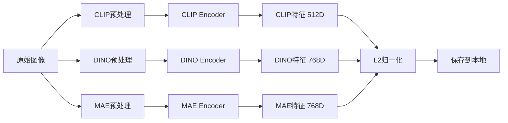

# 多视图预训练模型融合 - Stanford Cars 细粒度分类

本项目探索如何融合多种不同的视觉预训练模型（CLIP、DINO、MAE）来提升细粒度图像分类任务的性能。通过结合不同架构、不同预训练方法和不同训练数据的模型，实现多视图学习。

---

## 项目背景

### 细粒度图像分类挑战

细粒度图像分类（Fine-grained Image Classification）是计算机视觉中的一个挑战性任务，其特点是：

- **类别数量多**：如 Stanford Cars 数据集包含 196 个汽车品牌/型号类别
- **类间差异小**：不同类别之间的视觉差异非常细微
- **类内差异大**：同一类别内存在姿态、角度、光照等变化

### 多视图学习思想

单一预训练模型往往只能捕捉到图像的某些特定特征表示。通过融合多个本质不同的模型，可以：

1. **互补性**：不同模型捕捉不同类型的视觉特征
2. **鲁棒性**：减少对单一模型的依赖
3. **性能提升**：融合多个视角的表示通常优于单一模型

---

## 支持的预训练模型

| 模型 | 特征维度 | 预训练方法 | 训练数据 | 特点 |
|------|----------|------------|----------|------|
| **CLIP (ViT-B/32)** | 512 | 图文对比学习 | LAION-400M | 具有丰富的语义知识 |
| **DINO (ViT-B/16)** | 768 | 自监督蒸馏 | ImageNet-1K | 捕捉细粒度纹理和形状 |
| **MAE (ViT-Base)** | 768 | 掩码自编码 | ImageNet-1K | 强大的全局表示能力 |

---

## 实验设置

### 数据集

- **Stanford Cars Dataset**
  - 训练集：8,144 张图像
  - 测试集：8,041 张图像
  - 类别数：196 个汽车类别

### 项目结构

```
Quantifying-Representation-Reliability/
├── CLIP and DINO/                 # 双视图实验 (CLIP + DINO)
│   ├── extract_features2.py       # 训练集特征提取
│   ├── extract_test2.py           # 测试集特征提取
│   ├── model_test2.py             # 模型评估脚本
│   └── train_baseline2.py         # 训练脚本
│
├── CLIP DINO and MAE/             # 三视图实验 (CLIP + DINO + MAE)
│   ├── extract_features3.py       # 训练集特征提取
│   ├── extract_test3.py           # 测试集特征提取
│   ├── model_test3.py             # 模型评估脚本
│   └── train_baseline3.py         # 训练脚本
│
└── README.md
```

---

## 环境配置

### 系统要求

- Python >= 3.8
- CUDA >= 11.0 (推荐使用 GPU)
- 显存 >= 8GB

### 依赖安装

```bash
# 创建虚拟环境
conda create -n multiview python=3.10
conda activate multiview

# 安装 PyTorch (根据你的 CUDA 版本选择)
pip install torch torchvision --index-url https://download.pytorch.org/whl/cu118

# 安装其他依赖
pip install open-clip-torch transformers scipy tqdm pillow
```

### 依赖包列表

| 包名 | 版本 | 用途 |
|------|------|------|
| torch | >= 2.0 | 深度学习框架 |
| torchvision | >= 0.15 | 图像处理和数据加载 |
| clip | 1.0 | OpenAI CLIP 模型 |
| transformers | >= 4.30 | Hugging Face MAE 模型 |
| scipy | >= 1.10 | 解析 .mat 标注文件 |
| Pillow | >= 9.0 | 图像读取 |
| tqdm | >= 4.65 | 进度条显示 |

---

## 数据准备

### 1. 下载 Stanford Cars 数据集

```bash
# 创建数据目录
mkdir stanford_cars

# 下载训练集图片 (约 1.7GB)
wget http://ai.stanford.edu/~jkrause/cars/car_devkit.zip -O stanford_cars/devkit.zip
wget http://ai.stanford.edu/~jkrause/cars/cars_train.zip -O stanford_cars/cars_train.zip
wget http://ai.stanford.edu/~jkrause/cars/cars_test.zip -O stanford_cars/cars_test.zip

# 下载测试集标签 (用于评估)
wget https://folk.ntnu.no/haakohu/NNIFTI/2022/cars_test_annos_withlabels.mat -O stanford_cars/cars_test_annos_withlabels.mat

# 解压
cd stanford_cars
unzip devkit.zip
unzip cars_train.zip
unzip cars_test.zip
```

解压后的目录结构：
```
stanford_cars/
├── cars_train/           # 训练集图片
├── cars_test/            # 测试集图片
├── devkit/
│   ├── cars_train_annos.mat
│   └── cars_meta.mat
└── cars_test_annos_withlabels.mat  # 测试集标签
```

---

## 使用说明

### 方案一：双视图融合 (CLIP + DINO)

#### 步骤 1：提取训练集特征

```bash
cd "CLIP and DINO"
python extract_features2.py
```

输出：`multiview_train_features.pt` (约 1.2GB)

#### 步骤 2：训练融合模型

```bash
python train_baseline2.py
```

训练过程（30 epochs）：
- 自动划分 80% 训练 / 20% 验证
- 输出每个 epoch 的损失和验证准确率
- 保存模型权重：`multiview_fusion_mlp.pth`

#### 步骤 3：提取测试集特征

```bash
python extract_test2.py
```

输出：`multiview_test_features.pt`

#### 步骤 4：在测试集上评估

```bash
python model_test2.py
```

输出：测试集 Top-1 准确率

---

### 方案二：三视图融合 (CLIP + DINO + MAE)

#### 步骤 1：提取训练集特征

```bash
cd "CLIP DINO and MAE"
python extract_features3.py
```

输出：`multiview3_train_features.pt` (约 1.8GB)

#### 步骤 2：训练融合模型

```bash
python train_baseline3.py
```

保存模型权重：`multiview3_fusion_mlp.pth`

#### 步骤 3 & 4：测试集评估

```bash
# 提取测试集特征
python extract_test3.py

# 评估模型
python model_test3.py
```

---

## 模型架构

### 融合分类器结构

```
输入:
├── CLIP 特征 [Batch, 512]
├── DINO 特征 [Batch, 768]
└── MAE 特征 [Batch, 768]  (仅三视图方案)

特征拼接 → [Batch, 2048]

MLP 分类器:
├── Linear(2048 → 1024)
├── BatchNorm1d
├── ReLU
├── Dropout(0.5)
├── Linear(1024 → 512)
├── ReLU
├── Dropout(0.3)
└── Linear(512 → 196)  # 196 个汽车类别
```

### 训练配置

| 参数 | 值 |
|------|-----|
| 优化器 | Adam |
| 学习率 | 1e-3 |
| 权重衰减 | 1e-4 |
| Batch Size | 256 |
| Epochs | 30 |
| 损失函数 | CrossEntropyLoss |

---

## 特征提取流程



### 关键步骤说明

1. **模型加载**：从 Hugging Face / torch.hub 加载预训练权重
2. **图像预处理**：每个模型有独立的预处理流程
3. **特征提取**：冻结所有预训练模型的梯度，仅提取特征
4. **L2 归一化**：对所有特征进行 L2 归一化，确保不同模态特征在同一尺度
5. **特征保存**：保存为 PyTorch `.pt` 格式，便于后续训练加载

---

## 预期结果

### 性能对比

| 方案 | 特征维度 | 参数量 | 预期 Top-1 准确率 |
|------|----------|--------|-------------------|
| CLIP 单模型 | 512 | ~ | ~ |
| DINO 单模型 | 768 | ~ | ~ |
| MAE 单模型 | 768 | ~ | ~ |
| CLIP + DINO | 1280 | ~ | ~ |
| CLIP + DINO + MAE | 2048 | ~ | ~ |

---

## 常见问题

### Q1: 显存不足怎么办？

- 减小 batch size（修改 DataLoader 中的 `batch_size` 参数）
- 使用 CPU 提取特征（速度较慢但无需显存）

### Q2: 特征提取很慢？

- 确保使用了 CUDA (`device = "cuda"`)
- 考虑使用多 GPU 并行处理

### Q3: 测试集标签在哪里？

测试集标签文件 `cars_test_annos_withlabels.mat` 需要单独下载，已在数据准备部分提供下载链接。

### Q4: 如何使用自己的数据集？

需要修改 `extract_features*.py` 中的数据加载部分：
- 修改 `image_paths` 列表获取方式
- 调整 `num_classes` 参数（类别数量）

---

## 参考文献

### 预训练模型相关

- **CLIP**: Radford et al. "Learning Transferable Visual Models From Natural Language Supervision", ICML 2021
- **DINO**: Caron et al. "Emerging Properties in Self-Supervised Vision Transformers", ICCV 2021
- **MAE**: He et al. "Masked Autoencoders Are Scalable Vision Learners", CVPR 2022

### 数据集

- **Stanford Cars**: Krause et al. "Collecting and Annotating Fine-Grained Car Dataset", 2013

---

## 许可证

MIT License

---

## 联系方式

如有问题或建议，欢迎提交 Issue 或 Pull Request。
