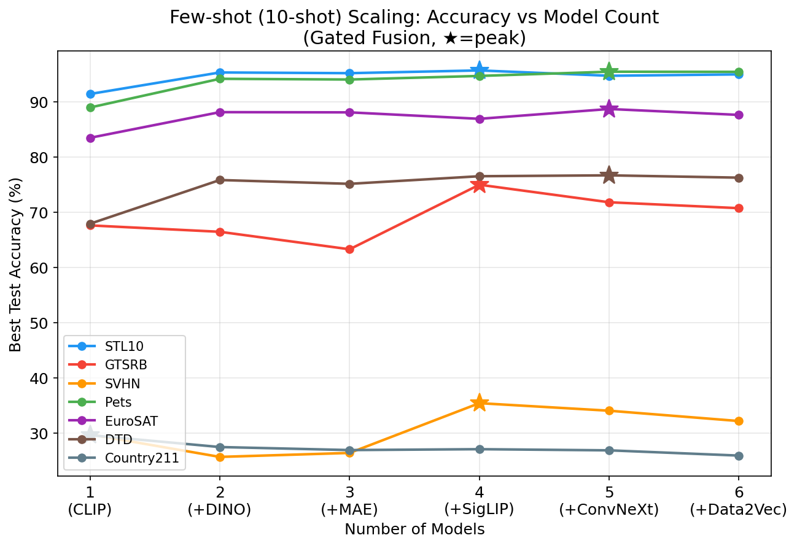
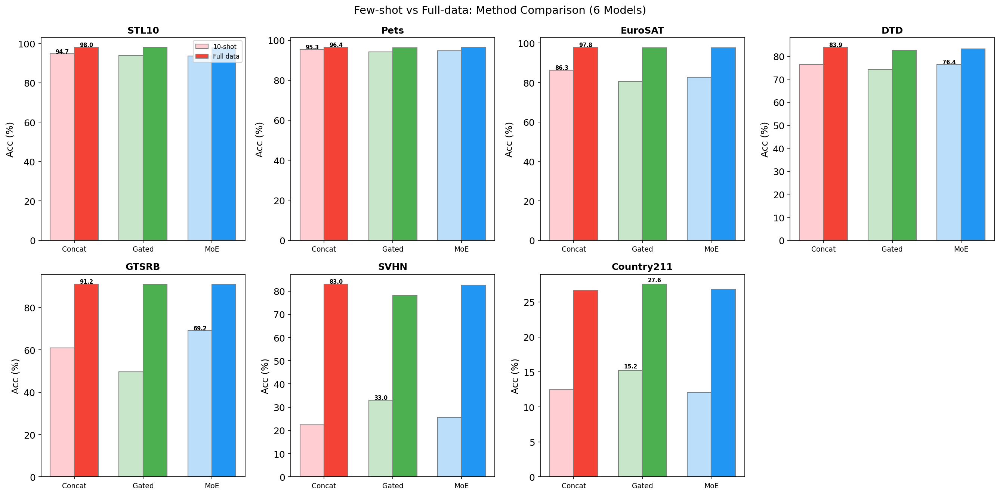
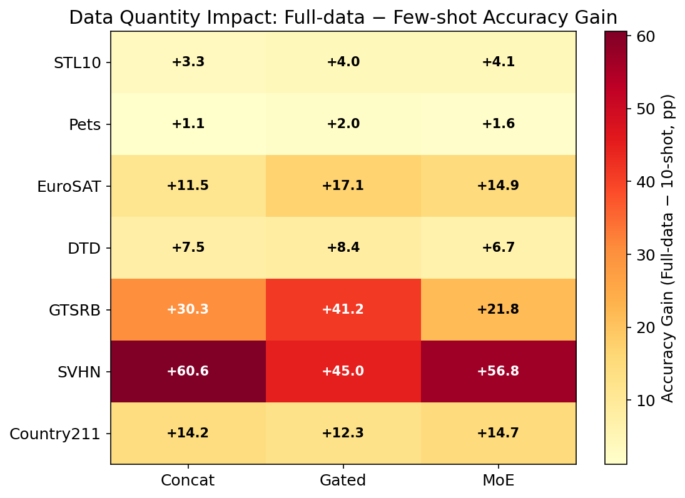
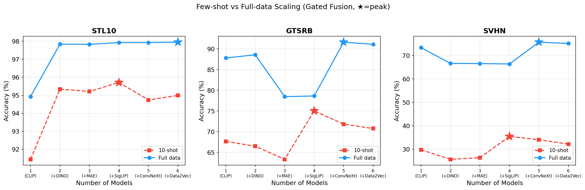
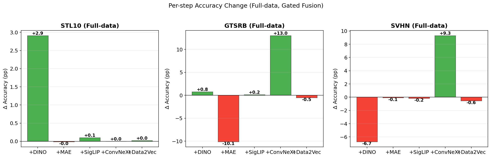

# 多模型特征融合：完整实验分析

## 一、核心研究问题

**多模型特征融合中，更多模型是否意味着更好性能？如果不是，原因是什么？**

我们通过三组实验系统地回答了这个问题：
1. **Scaling 实验**（10-shot）：模型数量 1→6 递增
2. **方法对比实验**（10-shot vs full-data）：Concat / Gated / MoE 横向比较
3. **Full-data Scaling 实验**：在完整训练集下重复 scaling 实验，区分"表征冗余"和"维度灾难"

---

## 二、实验一：Few-shot Scaling（10-shot, Gated Fusion）

**实验配置**：10-shot few-shot, Gated Fusion, 模型按 CLIP → +DINO → +MAE → +SigLIP → +ConvNeXt → +Data2Vec 顺序递增。

### 数据

| 数据集 | 1模型(CLIP) | 2模型(+DINO) | 3模型(+MAE) | 4模型(+SigLIP) | 5模型(+ConvNeXt) | 6模型(+Data2Vec) | 峰值 |
|--------|-----------|------------|-----------|--------------|-----------------|-----------------|------|
| STL10 | 91.44% | 95.34% | 95.21% | **95.71%** | 94.74% | 94.99% | 4模型 |
| Pets | 88.99% | 94.19% | 94.06% | 94.71% | **95.48%** | 95.45% | 5模型 |
| EuroSAT | 83.50% | 88.15% | 88.11% | 86.94% | **88.72%** | 87.65% | 5模型 |
| DTD | 67.93% | 75.85% | 75.16% | 76.54% | **76.70%** | 76.28% | 5模型 |
| GTSRB | 67.63% | 66.47% | 63.30% | **75.00%** | 71.82% | 70.75% | 4模型 |
| SVHN | 29.76% | 25.68% | 26.40% | **35.42%** | 34.05% | 32.18% | 4模型 |
| Country211 | **29.62%** | 27.47% | 26.92% | 27.08% | 26.87% | 25.92% | 1模型 |

### 发现

- **所有数据集在 4-5 模型时到达峰值，之后下降**
- CLIP → +DINO 带来最大提升（3-8pp）
- +MAE、+Data2Vec 几乎总是带来退化
- Country211 单模型最优

---

## 三、实验二：Full-data vs Few-shot 方法对比（6模型固定）

**实验配置**：6 模型（CLIP+DINO+MAE+SigLIP+ConvNeXt+Data2Vec），3 种方法（Concat / Gated / MoE Router），10-shot vs full data。

### 数据

| 数据集 | Concat(10s) | Concat(full) | Gated(10s) | Gated(full) | MoE(10s) | MoE(full) |
|--------|------------|-------------|-----------|------------|---------|----------|
| STL10 | 94.66% | **97.96%** | 93.80% | 97.85% | 93.65% | 97.80% |
| Pets | 95.26% | **96.40%** | 94.17% | 96.13% | 94.74% | 96.29% |
| EuroSAT | 86.30% | **97.83%** | 80.56% | 97.63% | 82.69% | 97.54% |
| DTD | 76.33% | **83.88%** | 74.20% | 82.61% | 76.44% | 83.14% |
| GTSRB | 60.93% | **91.18%** | 49.61% | 90.86% | 69.18% | 90.98% |
| SVHN | 22.47% | **83.05%** | 33.01% | 77.97% | 25.68% | 82.47% |
| Country211 | 12.47% | 26.64% | 15.25% | **27.58%** | 12.08% | 26.81% |

### 数据量对性能的影响

### 发现

**10-shot 最优方法分布**：Concat 赢 3/7，MoE 赢 2/7，Gated 赢 2/7
**Full-data 最优方法分布**：Concat 赢 6/7，Gated 赢 1/7，MoE 赢 0/7

- Full data 下 Concat 几乎全赢，且三种方法差距收窄到 1-2pp
- SVHN 提升最大：Concat 从 22.47% → 83.05%（+60.58pp）
- 10-shot 下 MoE/Gated 的优势来自隐式维度压缩，full data 下不再需要

---

## 四、实验三：Full-data Scaling（关键实验）

**实验目的**：区分"表征冗余"和"维度灾难"各自的贡献。

**实验配置**：Full data, Gated Fusion, 模型按 CLIP → +DINO → +MAE → +SigLIP → +ConvNeXt → +Data2Vec 递增。对比 few-shot scaling 曲线。

### 数据

**STL10**
| 模型数 | Few-shot | Full-data |
|--------|---------|-----------|
| 1 (CLIP) | 91.44% | 94.93% |
| 2 (+DINO) | 95.34% | 97.84% |
| 3 (+MAE) | 95.21% | 97.83% |
| 4 (+SigLIP) | **95.71%** | 97.93% |
| 5 (+ConvNeXt) | 94.74% | 97.93% |
| 6 (+Data2Vec) | 94.99% | **97.95%** |

**GTSRB**
| 模型数 | Few-shot | Full-data |
|--------|---------|-----------|
| 1 (CLIP) | 67.63% | 87.81% |
| 2 (+DINO) | 66.47% | 88.57% |
| 3 (+MAE) | 63.30% | 78.46% |
| 4 (+SigLIP) | **75.00%** | 78.62% |
| 5 (+ConvNeXt) | 71.82% | **91.63%** |
| 6 (+Data2Vec) | 70.75% | 91.10% |

**SVHN**
| 模型数 | Few-shot | Full-data |
|--------|---------|-----------|
| 1 (CLIP) | 29.76% | 73.33% |
| 2 (+DINO) | 25.68% | 66.61% |
| 3 (+MAE) | 26.40% | 66.52% |
| 4 (+SigLIP) | **35.42%** | 66.36% |
| 5 (+ConvNeXt) | 34.05% | **75.66%** |
| 6 (+Data2Vec) | 32.18% | 75.10% |

### 每步增量分析

### 三个数据集，三种行为模式

| 类型 | 数据集 | Few-shot 峰值 | Full-data 峰值 | 诊断 |
|------|--------|-------------|---------------|------|
| **纯维度灾难** | STL10 | 4模型（之后↓） | 6模型（一直↑） | Full data 完全消除了下降 |
| **冗余+维度灾难** | GTSRB | 4模型（之后↓） | 5模型（峰值上移） | +MAE 两种设定都暴跌 10pp |
| **纯表征噪声** | SVHN | 4模型（之后↓） | 5模型 | +DINO full data 仍跌 6.7pp |

---

## 五、核心发现

### 发现 1：CLIP + DINO 不是万能互补组合

我们曾认为 CLIP（语义）+ DINO（视觉结构）训练目标正交，永远互补。但 SVHN 证明这是错的：

| 数据集 | +DINO 效果（full data） | 任务特性 |
|--------|----------------------|---------|
| STL10 | **+2.91pp** | 自然图像分类（需要视觉结构） |
| GTSRB | **+0.76pp** | 交通标志（部分需要视觉结构） |
| SVHN | **-6.72pp** | 数字识别（不需要自然图像视觉结构） |

DINO 学的是自然图像的纹理、空间关系。对数字识别来说这是纯噪声，即使 full data 也无法消除。

### 发现 2：+MAE 对 GTSRB 是灾难性的

+MAE 在 GTSRB 上 full data 下仍然暴跌 **-10.11pp**。MAE 的 masked autoencoder 重建目标关注像素级低频信息，对需要精确图案识别的交通标志任务是有害表征。

### 发现 3：ConvNeXt（CNN）是最有价值的后加模型

| 数据集 | +ConvNeXt 效果（full data） |
|--------|--------------------------|
| STL10 | +0.00pp（已饱和）|
| GTSRB | **+13.01pp** |
| SVHN | **+9.30pp** |

ConvNeXt 是唯一的 CNN 架构，其余 5 个都是 ViT 变体。CNN 和 ViT 的特征表示真正正交——ViT 擅长全局语义，CNN 擅长局部模式识别（边缘、笔画、标志图案）。这验证了 Platonic Representation Hypothesis 的推论：**相似架构趋同，不同架构才能提供真正的互补**。

### 发现 4："先升后降"是两种因素的叠加

多模型融合性能下降 = **表征冗余** × **维度灾难**：

| 因素 | 描述 | Full data 能否解决 | 证据 |
|------|------|------------------|------|
| **维度灾难** | 高维特征 + 少量样本 → 分类器过拟合 | **能** | STL10 full data 下曲线一直升 |
| **表征冗余** | 相似训练范式的模型提供重复信息 | **部分缓解** | GTSRB 的 +MAE 两种设定都跌 |
| **表征噪声** | 某些模型的特征对特定任务有害 | **不能** | SVHN 的 +DINO full data 仍跌 6.7pp |

### 发现 5：最优融合策略取决于数据量

| 数据量 | 最优策略 | 原因 |
|--------|---------|------|
| Few-shot | Gated/MoE（维度压缩） | 分类器无法处理高维空间，需要路由做隐式降维 |
| Full data | Concat（全量保留） | 分类器有足够样本处理高维空间，全量信息 > 压缩信息 |

---

## 六、理论框架

上述发现可以从三个理论视角统一解释：

### 1. Platonic Representation Hypothesis（Huh et al., ICML 2024）

不同预训练模型趋同到相似的统计表示。相似训练范式（MAE ≈ DINO ≈ Data2Vec，都是自监督 ViT）的模型表征冗余最严重。不同架构（CNN vs ViT）的模型才能提供真正的互补。

### 2. Information Bottleneck（Kawaguchi et al., ICML 2023）

最优表征应该压缩输入同时保留对标签有用的信息。每加一个模型，特征维度线性增长，但有用信息边际递减。存在最优压缩点，超过后信噪比下降。

### 3. Bias-Variance-Diversity Decomposition（Wood et al., JMLR 2023）

集成误差 = Bias² + Variance − Diversity。当模型间相关性 ρ 高时（Platonic convergence），增加模型几乎不降低 variance，而特征维度增长使优化变难（bias 上升）。

---

## 七、方法论启示

### 模型选择：基于互补性而非数量

- **优先选择训练目标正交的模型**：CLIP（语义）+ DINO（视觉结构）+ ConvNeXt（CNN 局部特征）
- **避免堆叠训练范式相似的模型**：MAE、DINO、Data2Vec 选一个就够
- **考虑目标任务的特性**：DINO 对自然图像好，对数字/符号识别有害

### 融合策略：基于数据量

- **数据稀缺时**（few-shot）：用 Gated/MoE 做隐式维度压缩
- **数据充足时**（full data）：直接 Concat，简单即最优

### 未来方向：CKA-Guided Model Selection

用 CKA（Centered Kernel Alignment）在目标任务上量化模型间表征相似度，筛掉噪声/冗余模型，从源头避免问题——而不是让分类器去学着忽略它们。

---

## 八、参考文献

1. Huh, Cheung, Wang, Isola. *"The Platonic Representation Hypothesis"*, ICML 2024
2. Kawaguchi et al. *"How Does Information Bottleneck Help Deep Learning?"*, ICML 2023
3. Wood et al. *"A Unified Theory of Diversity in Ensemble Learning"*, JMLR 2023
4. Kornblith et al. *"Similarity of Neural Network Representations Revisited"* (CKA), ICML 2019
5. Wu et al. *"Characterizing and Overcoming the Greedy Nature of Learning in Multi-modal Deep Neural Networks"*, ICML 2022
6. *"Less is More: On the Feature Redundancy of Pretrained Models"*, arXiv 2023
7. *"Diffused Redundancy in Pre-trained Representations"*, NeurIPS 2023
8. *Eagle: "Exploring the Design Space for Multimodal LLMs with Mixture of Encoders"*, ICLR 2025
